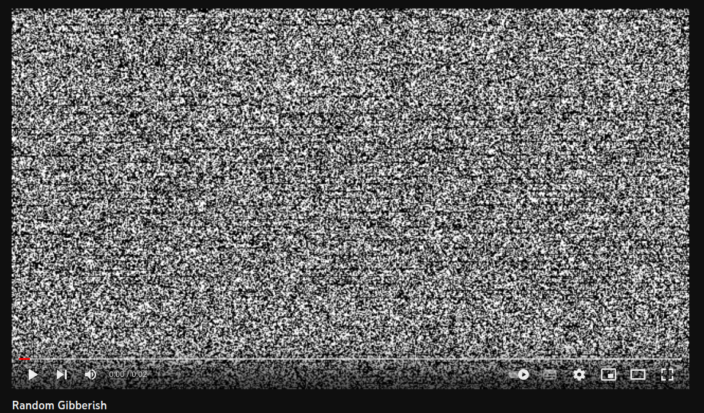
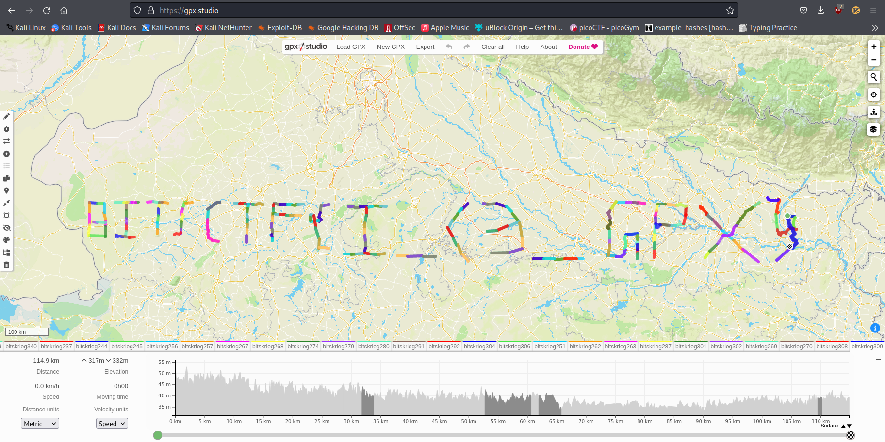

# Broken Tv

## Challnege Description

The police chief's Tv has lost connection, He is no longer able to watch his cartoon in peace. He called Anakin01 to investigate,who inventually realized that this is the work of some hacker.Anakin01 is now wondering what can he extract from the video.Help him in his journey

[chall link](https://youtu.be/dWipvwxjdps)

## Solution

The links takes us to a youtube video which looks like a broken tv but if you keep up with the recent new you might be knowing that it is actually the infinite storage glitch.We download the video and extract the data using the infinite storage glicth tool.

You can find more information regarding this tool at [infinite-storage-glitch](https://github.com/DvorakDwarf/Infinite-Storage-Glitch)

After extracting the data we get a zip file which is password protected.We crack the password using john the ripper tool.You can refer this [link](https://www.freecodecamp.org/news/crack-passwords-using-john-the-ripper-pentesting-tutorial/) to get more information abut john.

After john succesfully cracks the password we use it to unzip the file.The extracted data contains more than 200 files with the extension .gpx.GPX files can be viewed using google maps or any other mapping software.

The limitation of google maps is that it does allow multiple files to be uploaded at once so to counter this issue you can eihter write a code to merge all the gpx files or use can use the website [gpx studio](https://gpx.studio/). After uploading all the files on the website you get the flag written out.

Flag:BITSCTF{!_<3_GPX}

## Author

**Anakin01**
