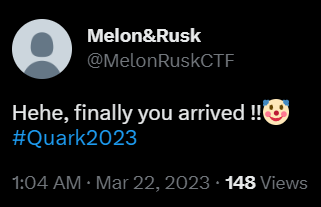
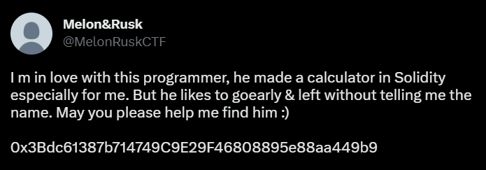
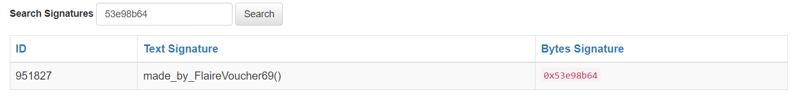
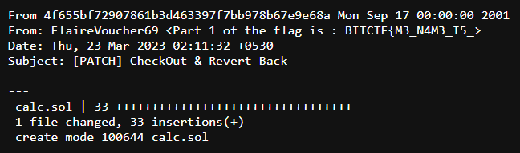
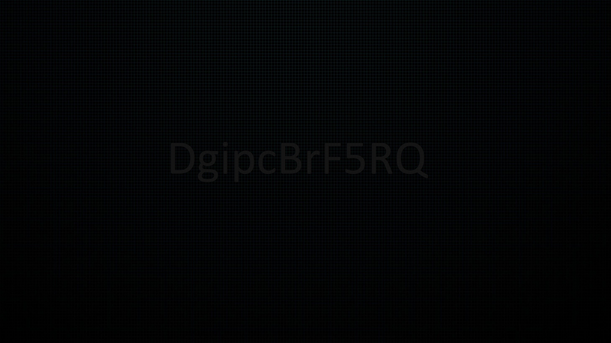
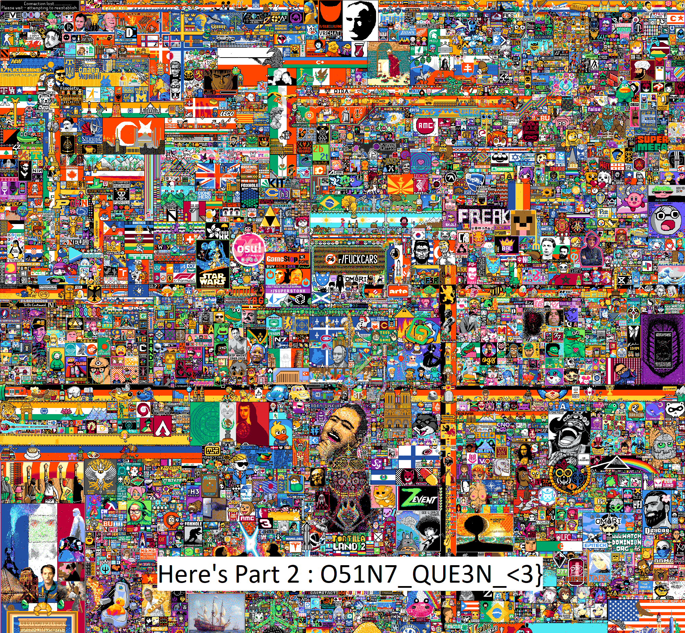

# Love at 1st Sight
## Description
This programmer disappeared suddenly & the one who had crush on him was left alone. Earlier pigeons use to deliver the messages but can the blue bird be able to make these lovers communicate ?? UwU. But first figure out what is this even !!!
```
1638262882013163520
```

## Solution
Blue bird hints Twitter. Now, we can type in the tweet ID with any username & it will redirect to the correct Twitter handle automatically.
<br><br>
Visiting the URL:
```
https://twitter.com/anyuser/status/1638262882013163520
```
We get redirected to:
```
https://twitter.com/MelonRuskCTF/status/1638262882013163520
```


<br><br>
Looks nothing interesting here!  
Exploring other tweets, we come across this:


<br><br>
Reading the tweet, it seems we are talking about a contract deployed on Goerli Testnet. Looking up `0x3Bdc61387b714749C9E29F46808895e88aa449b9`, we land up here:
```
https://goerli.etherscan.io/address/0x3Bdc61387b714749C9E29F46808895e88aa449b9
```
Seems nothing interesting in the transactions. Also the contract source code isn't verified, so let's try decompiling the bytecode. On decompiling the bytecode, we get the following:

```solidity
# Palkeoramix decompiler. 

const unknown53e98b64 = 32, 51, 0xfe57656c636f6d6520746f207468652063616c63756c61746f722e205965732c206974206973206d616465206279206d65203a, mem

def storage:
  result is uint256 at storage 0

def getResult() payable: 
  return result

#
#  Regular functions
#

def _fallback() payable: # default function
  revert

def add(uint256 _a, uint256 _b) payable: 
  require calldata.size - 4 >=′ 64
  require _a == _a
  require _b == _b
  if _a > _a + _b:
      revert with 'NH{q', 17
  result = _a + _b

def sub(uint256 _a, uint256 _b) payable: 
  require calldata.size - 4 >=′ 64
  require _a == _a
  require _b == _b
  if _a - _b > _a:
      revert with 'NH{q', 17
  result = _a - _b

def mul(uint256 _a, uint256 _b) payable: 
  require calldata.size - 4 >=′ 64
  require _a == _a
  require _b == _b
  if _a and _b != _a * _b / _a:
      revert with 'NH{q', 17
  result = _a * _b

def div(uint256 _a, uint256 _b) payable: 
  require calldata.size - 4 >=′ 64
  require _a == _a
  require _b == _b
  if _b <= 0:
      revert with 0x8c379a000000000000000000000000000000000000000000000000000000000, 'The second parameter should not be 0'
  if not _b:
      revert with 'NH{q', 18
  result = _a / _b
```
In line 3, we see a weird hexstring. On decoding it we get:
```
Welcome to the calculator. Yes, it is made by me :)
```
Hmm something really sussy. As we cannot find anything else, lets try our hands on the function signature `53e98b64`. Luckily we found an entry on [**Ethereum Signature Database**](https://www.4byte.directory/)



It says `made_by_FlaireVoucher69()`. Hmm, it's possible that the so called calculator's source code is dumped in a GitHub repository by the user `FlaireVoucher69`.
<br><br>
On searching through GitHub, we found this [**repository**](https://github.com/FlaireVoucher69/SolCalculator).
<br><br>
One of the commits has a message `CheckOut & Revert Back`. On appending `.patch` to the commit URL, we get the [**following**](https://github.com/FlaireVoucher69/SolCalculator/commit/4f655bf72907861b3d463397f7bb978b67e9e68a.patch):



Oh! We got the Part-1 of the flag
```
BITCTF{M3_N4M3_I5_
```
But what did we miss, which will lead us to the 2nd part of the flag? The commit mentioned to ***Revert Back***, so lets check the Twitter handle again. On carefully observing, we see some text written in the banner:



`DgipcBrF5RQ` - Seems like a [**YouTube link**](https://www.youtube.com/watch?v=DgipcBrF5RQ)
<br><br>
Did you get Rick Rolled? :P  
I am really sorry for that but the video doesn't really seem to be of much importance. Infact, theres is no other video or community posts on the channel. So, lets try to find something else.
<br><br>
The only other stuff that we found on the channel was it's `r/Place` channel banner. But, it's possible that we are only seeing a part of it. So, lets use some [3rd party tool](https://backlinkvalidator.com/tools/download_youtube_thumbnail.php) to scrape out the banner.
<br><br>
On downloading the banner, we get the following image:



Hooray! We found the 2nd part of the flag:
```
O51N7_QUE3N_<3}
```

## Flag
On combining both the parts, we get the flag:
```
BITCTF{M3_N4M3_I5_O51N7_QUE3N_<3}
```

## Author
[**@rskbansal**](https://github.com/rskbansal)