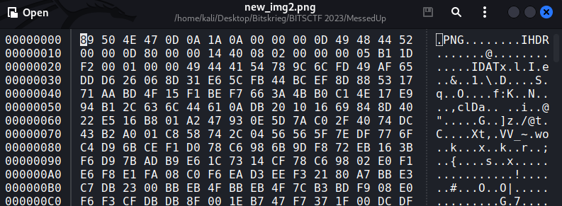
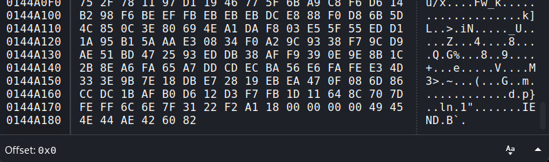
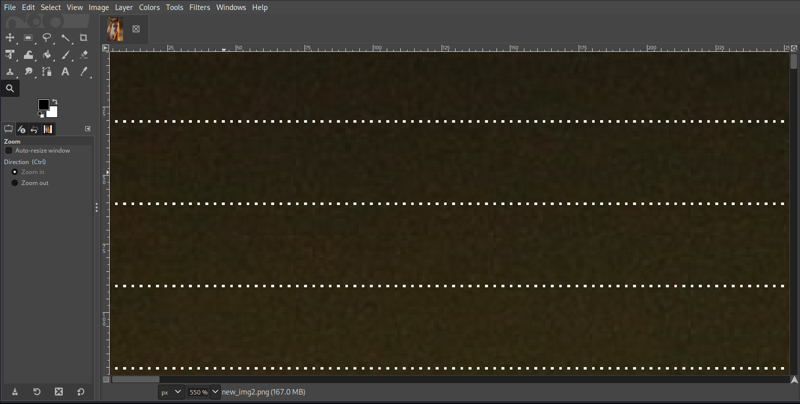

# Messed Up

## Challenge Description

City police has recovered a file from a notorious hacker named **Anakin01** but the chief of police is visually impared can you help him find the flag

## Solution

We are given a file which appears to be a pdf file by looking at its extension but it cannot be opened directly,So to determine the file type we use the file command.

```
┌──(kali㉿kali-raspberry-pi)-[~/Desktop/Bitskrieg/BITSCTF 2023/MessedUp]
└─$ file chalfinal.pdf 
chalfinal.pdf: data

```

file command says that it is a data file which means that it is unable to identify it as any known file type.We then decide to do a further analysis by checking the header of the file.

```

00000000: 894e 5047 0d0a 1a0a 0000 000d 4944 5052  .NPG........IDPR
00000010: 0000 0d80 0000 1440 0802 0000 0005 b11d  .......@........
00000020: f200 0100 0049 5041 4478 9c6c fd49 af65  .....IPADx.l.I.e
00000030: ddd6 2606 8d31 e65c fb44 bcef 8d88 5317  ..&..1.\.D....S.
00000040: 71aa bd4f 15f1 bef7 663a 4bb0 c14e 17e9  q..O....f:K..N..
00000050: 94b1 2c63 6c44 610a db20 1016 6984 8d40  ..,clDa.. ..i..@
00000060: 22e5 16b8 01a2 4793 0e5d 7ac0 2f40 74dc  ".....G..]z./@t.
00000070: 43b2 a001 c858 742c 0456 565f 7edf 776f  C....Xt,.VV_~.wo
00000080: c4d9 6bce f1d0 78c6 986b 9df8 72eb 163b  ..k...x..k..r..;

```

We can clearly see that it is a png file which is corrupted so we use ghex to edit and repair the header and footer of the file.





After we fix the image we can open it in any image viewer.At first the image appears to be a simple image of a horse but after a closer look we see that some rows of pixels are different than the orginal image.



We use gimp to check exact pixel locations of the pattern.Now we decide to combine all these odd looking pixels together and form a new image.To Achieve this we write a python code.

```
#!/usr/bin/python
from PIL import Image

img1 = Image.open('new_img2.png')
img1 = img1.convert('RGB')
pixels1 = img1.load()
width1, height1 = img1.size

new_img = Image.new('RGB', (width1//3, height1//30))
new_pixels = new_img.load()

for y in range(height1):
    for x in range(width1):
    	if x%3 ==0 and y%30 ==0 and y/30 < height1//30 and x/3 < width1//3:       
    		new_pixels[x/3,y/30] =pixels1[x,y]
new_img.save('decrypted.png')

```
After running this code we get a blurred image of the flag. :)


Flag:BITSCTF{P1x3l_1357}

Note: As a Bonus I have also uploaded the image encryption script.

## Author

Anakin01.


