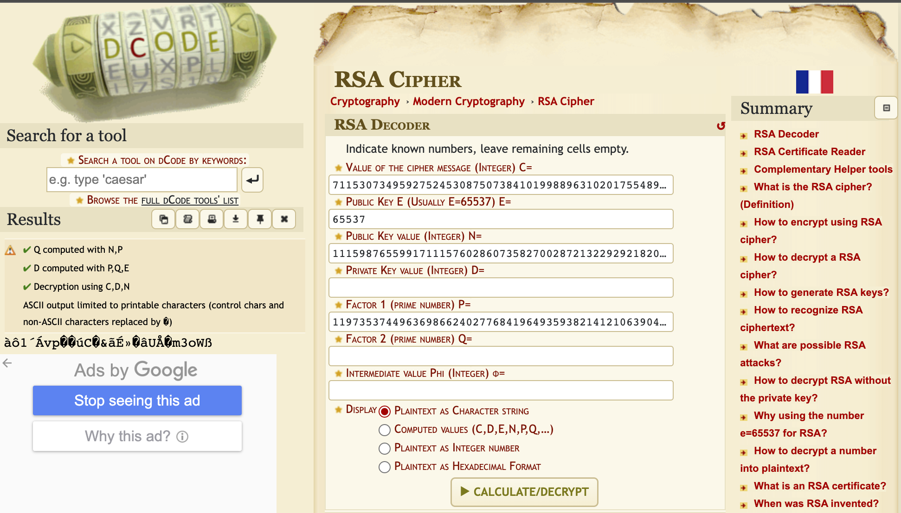
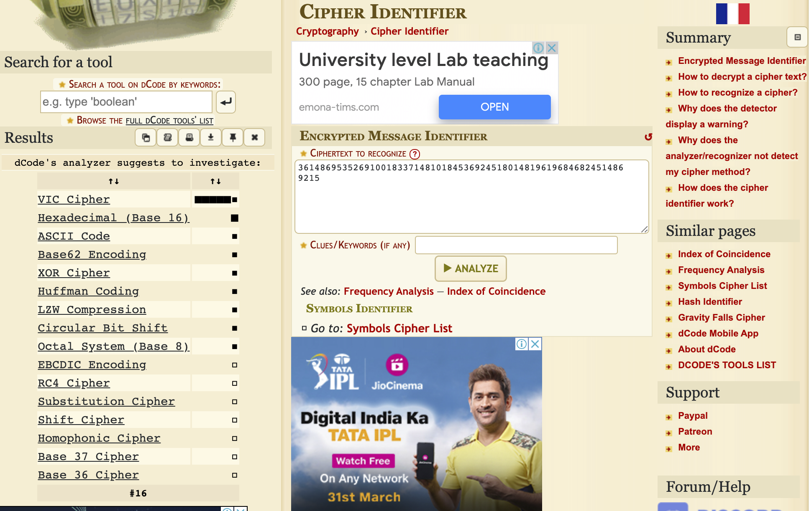
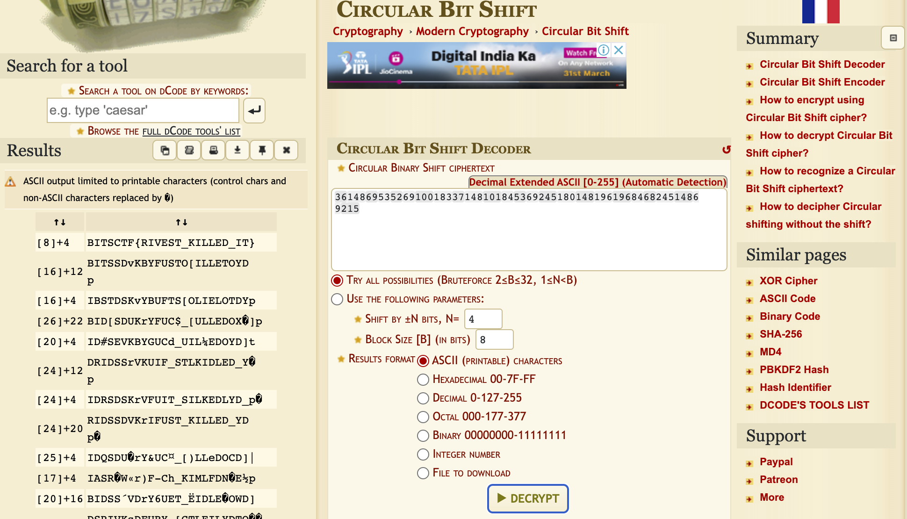

# RiShaAdl

## Challenge Description 

An unamed witness called in the police station to report about a murder.He then sent this file with random numbers.Can you find the killer.

## Solution

The Challenge name RiShaAdl reffers to Rivest Shamir and Adlemann who were the inventors of the RSA encryption Algorithm.The file attachted has the following data

```

n =111598765599171115760286073582700287213229292182098233659408776971016667150820931667723364494060422578220234752373141415212948110631241078110507076790152220075115393126493587064186565805022778591559435083903320189693990483717806385032154280917234608087260013623812437842467208364547034230079885561896975840789

e= 65537

p = 11973537449636986624027768419649359382141210639045414133023802263499651617150613559220815757297164508995127431498714927314385145550991522382872354057678443

c= 7115307349592752453087507384101998896310201755489982811782960456916852519024573956216692511365287902482150890729269656150369927621003417690060434001843147367898643465429603458017427009211669853796315227888684076279713079707131990414700963325307189783459392119590632688933886073623931064592458285079897475017

```

Our belief that rsa is used is further cemented by looking at the constants.

We are clearly given the public key(n),Factor 1,e and cipher text(c) in the text file.Solving the rsa alogorithm using these values is pretty easy as bith factors are given.Here i have used an online tool to decrypt the RSA data.



dcode succesfully decrypts the rsa but we get some random text as output which means that the encrypted number cannot be directly converted into ascii text hinting us of multiple levels of encyption.So we take the numerical output of the rsa and try to find its encryption type.

We use dcode's cipher identifier to identify the type of cipher use you could use any other cipher identifier of your choice.We then try every possible cipher that dcode shows.



Finaaly when we try circular bit shift cipher we get the flag.



We get the Flag 
```
BITSCTF{RIVEST_KILLED_IT}
```
