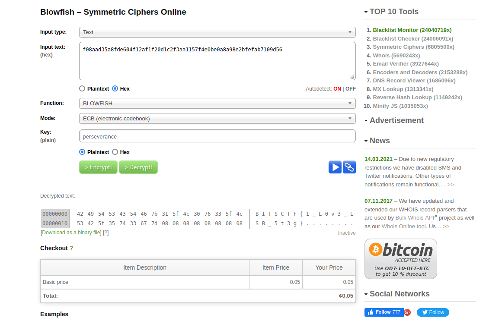

# Sounds Weird

## Chalenge Description

Police caught a man high on **LS*** who is suspected to be the part of the kidney selling organization. Police recovered nothing suspicious from him except an audio file. Police is trying to interogate him but he is to high to answer anything. He says he is the least significant  member of the organization and his work is to **blow** ballons and look after **fishes** in the fish tank.
Anakin01 knows that perseverance is the key to success in cracking such codes.Help find investigate the file.

## Solution

The decription suggests that LSB stegnography may have been used to encrypt some hidden messae in the wav file.We then write a simple pythn LSB decryption Script

```

import wave

# Extract data from audio file using LSB steganography
def extract_data(audio_file):
    # Open audio file
    with wave.open(audio_file, "rb") as wav:
        # Get audio file parameters
        params = wav.getparams()
        nframes = params[3]
        sampwidth = params[1]
        frames = wav.readframes(nframes)

        # Extract data from audio file
        data_bin = ""
        for i in range(0, len(frames), sampwidth):
            for j in range(sampwidth):
                # Convert byte to binary string
                byte_bin = int_to_bin(frames[i + j])
                # Extract least significant bit
                data_bin += byte_bin[-1]

        # Convert binary data to ASCII string
        data = ""
        for i in range(0, len(data_bin), 8):
            byte = bin_to_int(data_bin[i:i+8])
            data += chr(byte)

        return data

# Convert integer to binary string
def int_to_bin(n):
    return bin(n)[2:].zfill(8)

# Convert binary string to integer
def bin_to_int(b):
    return int(b, 2)

# Test the function
audio_file = "chall.wav"
extracted_data = extract_data(audio_file)
print("Extracted data:", extracted_data)

```
The Extracted data gives us 

```

Extracted data: BITSCTF{f08aad35a8fde604f12af1f20d1c2f3aa1157f4e0be0a8a98e2bfefab7109d56}~á4ExTg`#Ý^··!×Á°°#x+ßac.³ëL<[_ï£E.ÓôÞf1¬#dr¦ãMEgO7ÊjY¿Dùë:ã×GÏôÉâú  )X`çztáÜi©âWåóÅú▒×:îè1å-mÂìíJiêþ³ %,jP¦=D,8ebÅDaÐöÅ4t©¤â¨¿ð+&?ÛÒóN$çÖ#̦²qÊx£]N½
                                                                                                        îÞ »ëúü­i¶T4¤^³ÀgæoYorB05%É°o8|òó½å-CæÂ4®¹vöÄ~ZyÎ×hùÇ´^"8~·>â(µiÝuîî
w
 É▒;Ü?eB¨ªY­Uæ«¥H)ótêÇbLjóàc½ÿ^ó°¸7ߣMº#Ü!7J\¯Á,¡C^¶¾æF¨Álã|aoii²óâÉQUÙÛzªy>ö#ñ¿¹MÈY½~ABÍ·ï¹>üb ÄòQ(gñÓå¤/tw8|¬N乯|°äCÿ
                                                                                                                        5­\S¤×X¥§Ì~b=ü▒jsËOÎ}ã~¿Gâj¿Õ¸]~±yåÑ»¹¾MrPQñ¥Dnæ@+ÿ!+ÁûVFþ®ÚåE¹²$ZêËQ|ò·kMÀäXõÁmäò/æ²è#B½u^
"=4ÏAÇÐ3^wUÖÆÐB!|ü¡8¨ê¬8ü¦>®ö¹Êÿ{oåÿ!ãËÆpÇ
                                           ²

í¿zúÃnKì[Zwթı¥{$Uh#g¨){ÝQðê§$qT}©ßfýñÖúµrÖmù´·&ÍÎIj>¨ù·ð¤×DÁDg-7Xé3ýK"¹ö/¾ÎùV¥ûæìÉÈnÊê3øcY¯;¤¶G#¿þO;hî3è¬%ØÞ®Oà'ë¿ìtþ¶}ÆEï¿W.þo]éWêBKláP39Atõ"¿Ø7ÈÌÌ{j¹Ö}i&Wå
»áàÇm[Y>eò¿PL,±¦msâokcOjK<92|ã\Ó>¹Á¤´µLpì¢öû±£ýååêÒ
                                      ñN¥Dx©ô»´9Vé@¿~õiÅ×ö8­H×▒f?ã5
¬ÄÜDk²JÀ.\;-¡²¬nÉ;¾!¸;9Ù3ÝzS××âÓö¼Øâ¹ÅÞ¦SÄzaNw0%
                                                2Òº£¹Æ#3Qz×.......
                                               
```                                             
We get the flag but it appears to be encrypted. Once again if we carefull go through the description it clearly hints us to use blowfish decryption.We can use any online blowfish decryption tool with the key "persistance" to get the flag



Flag :BITSCTF{1_L0v3_LSB_5t3g}

## Author

**Anakin01**

