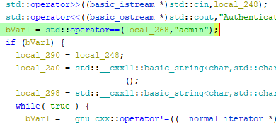
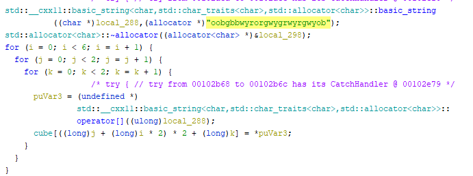
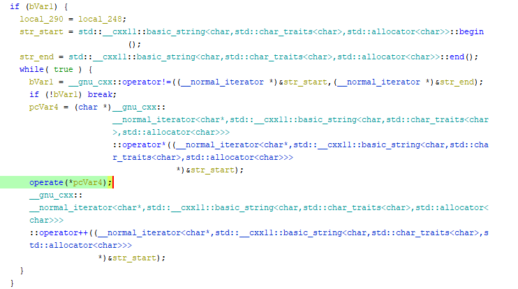

## Challenge Description

Have you checked out our [cubix](https://www.instagram.com/p/Cp2nr6bMHoh/?utm_source=ig_web_copy_link) event?

## Writeup

On running the binary it asks for username and a key. So, open the file in ghidra. 

In the main function we can see it is checking if the username is admin or not.



On further analysing the main function we can see that the string ```oobgbbwyrorgwygrwyrgwyob``` is getting stored in a 3d array ```cube[6][2][2]```.



So basically this is a 2x2 rubiks cube and it's scrambled combination is stored in the given string. On analyzing the loop inside the if statement after username check we can see that the operate function is getting called on it which performs some operations on the 3d array, which are basically denote the cube moves R,L,F,U...



In the end the main function is calling the ```solved()``` function which just check if the cube is solved or not.

So now our key will be the operations which we should perform on the cube to get it in a solved state. You can use any use any online cube solver to get the key or you can use ```script.cpp``` :)

The key is ```DDBBLDBLDDBD```

PS: The script can take time to run since it is checking all the combinations to solve the cube and backtracking them.

## Brute Approach

This was not a long key and the no. of letters were also less so we can also perform brute force attack on the key. Since, there is a 1 sec sleep in between we have to write the program again to perform the brute operation.

### Author
[**InimicalX**](https://github.com/Akhil2193)