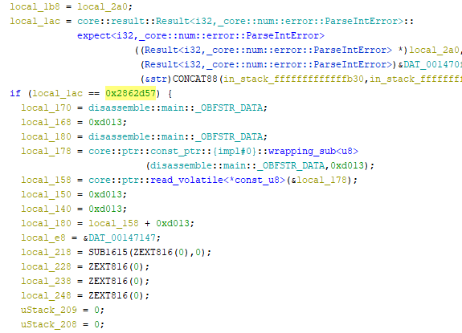

## Challenge Description

tuffy and fellow pirates stumble upon a mysterious island and decide to disassemble in order to find the treasure ASAP.
They find it, but they need a password. help them crack the password from this RUSTy file.

## Writeup

Since the challenge mentions the disassembly we will directly open the file in ghidra. And from the description, it is rust binary file. So decompiling the functions and carefully looking through the code you can find a numerical comparison:



Converting this to decimal we get ```42347863``` which is the numerical argument that the binary was asking for.

### Author
[**InimicalX**](https://github.com/Akhil2193)