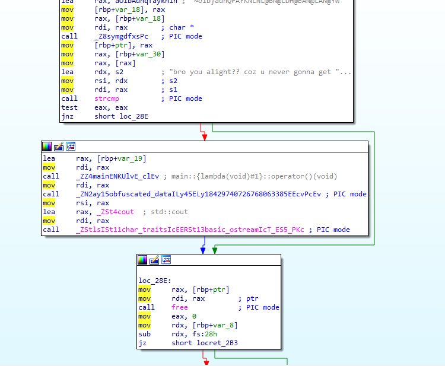
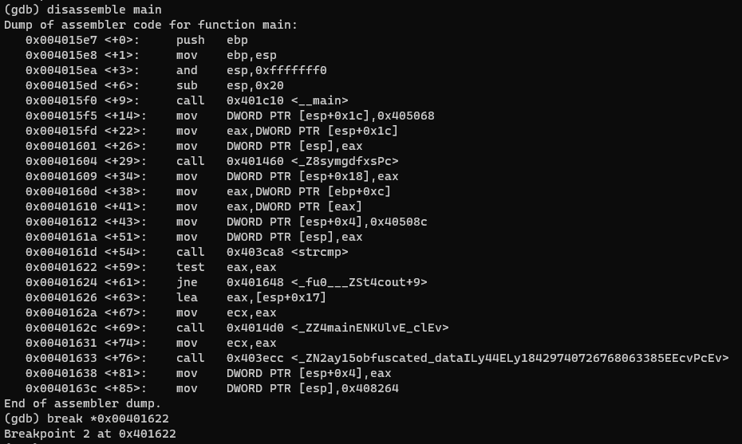
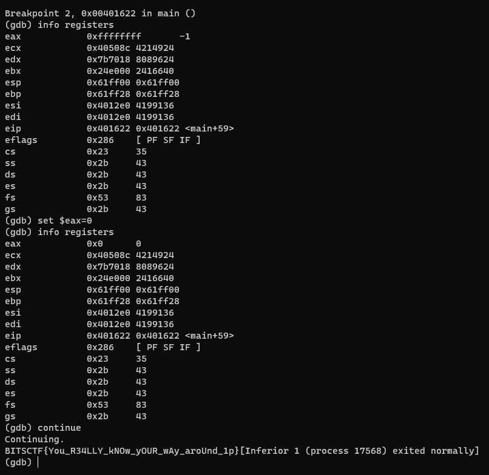

## Challenge Description

After a fierce pirate battle with another pirate ship, tuffy went to loot the other ship's treasures.
he found a file with the hint **Dont go with flow**. Help him crack it and loot the wrecked ship.

## Writeup

Analyse the binary in IDA and check the flow of the program. We can see there is a compare statement with a string.



Load the binary in gdb, and disassemble the main function. We can see that it is skipping the middle block if the condition is invalid. So we will open the gdb to override the if condition manually. Below is the disassembly of the main function.



We set a breakpoint at `0x00401622` and change the ```eax``` register to 0, to force the strcmp to be true. This will print the flag.



### Author
[**InimicalX**](https://github.com/Akhil2193)